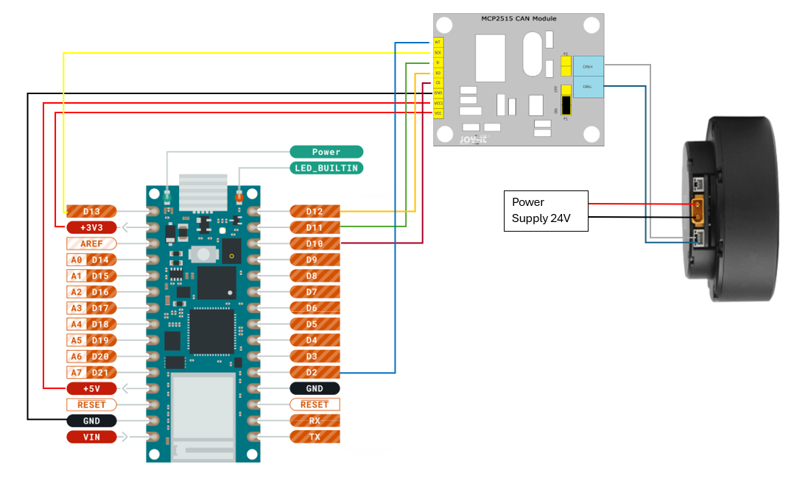

# Arduino Library for Cube Mars TMotor AK60-6

This library implements the servo protocol of the Cube Mars TMotor AK series. To use the library, switch the motor to Servo Mode and configure a Controller ID with the CubeMars Upper Computer Software. The library supports multiple motors.

## Prerequisites
This library is compatible with the Arduino Nano RP2040 microcontroller. It is using the [MCP_CAN](https://github.com/coryjfowler/MCP_CAN_lib) library and a MCP2515 controller to handle the CAN connection with the motor. The following wiring is used:



## Installation
1. Install "mcp_can" by coryjfowler with the Arduino Library Manager
2. Download this Repository as ZIP file
3. In the Arduino IDE: Sketch --> Include Library.. -> Add .ZIP Library..
4. Chose the downloaded .ZIP file
5. Restart IDE

## Usage
Create a CAN connection and a servo_connection object:
```C++
#include "mcp_can.h"
#include "TMotor_ServoConnection.h"

#define CAN0_INT 2  // CAN message pin
#define ID_MOTOR 1  // motor set with the CubeMars Upper Computer Software

MCP_CAN CAN0(10); // set SPI select pin to pin 10
TMotor_ServoConnection servo_conn(CAN0);  // create CAN Servo Connection
```

Initialize the CAN Connection in the setup function. After a connection could be established successfully, you can set the zero position of the motor:
```C++
void setup() {
  // establisehd serial connection to PC
  while (!Serial);
  Serial.begin(115200);
  // establish connection between Arduino and MCP2515
  while(CAN0.begin(MCP_ANY, CAN_1000KBPS, MCP_16MHZ) != CAN_OK){ // check if conenction could be establisehd; retry if not
    Serial.println("Error Initializing MCP2515...");
    delay(100);
  } 
  Serial.println("MCP2515 Initialized Successfully!");
  CAN0.setMode(MCP_NORMAL); // Change to normal mode to allow messages to be transmitted

  servo_conn.set_origin(ID_MOTOR, 0); // set zero position of motor until power-off
}
```

The loop function can be used to repeatable send a command to the motor, for example, with the set_duty_cycle(motor_id, duty_cycle) command. To read the incoming CAN messages from the motor, use the can_receive() function if the MCP2515 signals that a message is available. Use print_motor_vars(motor_id) to print the received data.
```C++
void loop() {
  servo_conn.set_duty_cycle(ID_MOTOR, 0.1);
  delay(5);
  // check for incoming messages
  if (!digitalRead(CAN0_INT)) {
    // get all messages in waiting queue
    while (CAN_MSGAVAIL == CAN0.checkReceive()) {
      // receive and process messages
      servo_conn.can_receive();
    }
  }
  // print received data to Serial output
  servo_conn.print_motor_vars(ID_MOTOR);
}
```
