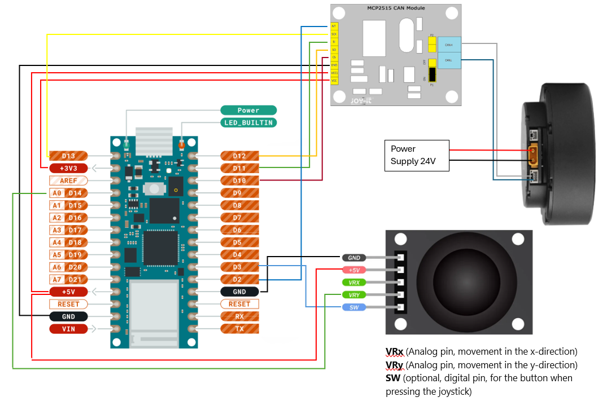

# Examples

- simple_motor_control: Control one motor. Use the wiring on the main page.
- multiple_motors: Control multiple motors. Just add the other motors to the CAN-Bus.
- motor_with_joystick: Control the motor with a simple joy stick. Use the following wiring:

